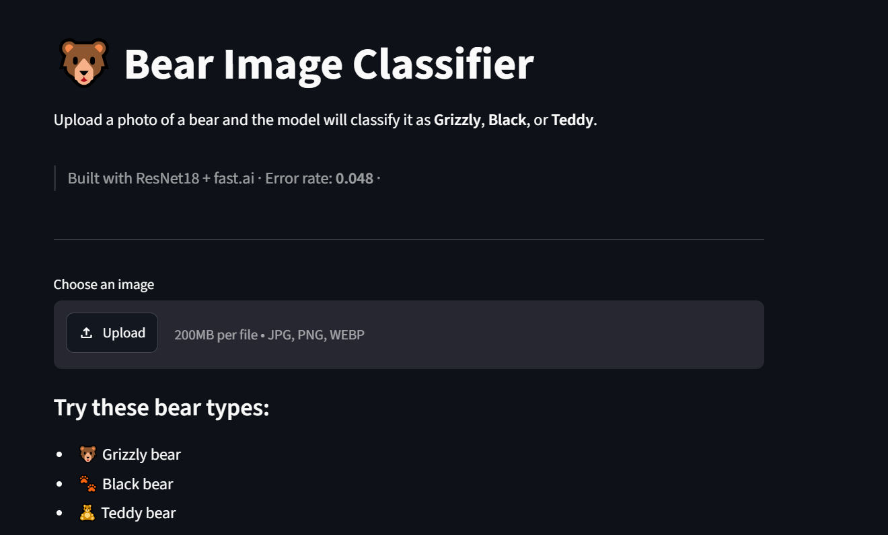

# 🐻 Bear Image Classifier

A deep learning model that classifies images of bears into three categories: **Grizzly**, **Black**, and **Teddy**. Built as Week 1 of my ML learning journey using transfer learning with ResNet18.

🚀 **[Live Demo →](https://yourname-bear-classifier.streamlit.app)**

---

## 📌 Project Overview

This project fine-tunes a pretrained ResNet18 model (PyTorch) using the fast.ai library to distinguish between three types of bears from images. The goal was to go from raw dataset to a deployed production app in a single week.

**Key results:**

- ✅ Error rate: **0.048** (~95.2% accuracy)
- ✅ Only 2 misclassifications — grizzly/black bear mix-ups (visually similar in certain lighting)
- ✅ Model deployed as a live Streamlit web app

---

## 🖥️ Demo

Upload any bear image and the app will:

- Predict the bear type (Grizzly, Black, or Teddy)
- Show confidence level with a color-coded indicator
- Display a probability bar chart across all three classes



---

## 🗂️ Repository Structure

```
bear-image-classifier/
│
├── app.py                # Streamlit web app
├── bear_model_full.pth   # Trained model (fast.ai ResNet18)
├── classes.json          # Class labels for the deployed model
├── bear_classifier.pkl   # Full fast.ai Learner (for Colab evaluation/fine-tuning)
├── black                 # Dataset: black bear images
├── grizzly               # Dataset: grizzly bear images
├── teddy                 # Dataset: teddy bear images
├── bear_classifier.ipynb # Full training notebook
├── requirements.txt      # App dependencies
└── README.md
```

> **Note on model files:**
>
> - `bear_model_full.pth` — used by the Streamlit app for deployment
> - `bear_classifier.pkl` — use this in Colab to continue training or evaluation

---

## 🧠 What I Used

| Tool         | Purpose                              |
| ------------ | ------------------------------------ |
| fast.ai      | High-level training API              |
| PyTorch      | Deep learning backend                |
| ResNet18     | Pretrained model (transfer learning) |
| Streamlit    | Web app and deployment               |
| Plotly       | Confidence bar chart                 |
| Google Colab | Training environment                 |

---

## ⚙️ How It Works

1. **Data collection** — Images sourced and organised into three classes
2. **DataLoaders** — Built using `ImageDataLoaders` with data augmentation (random flip, rotation, brightness/contrast)
3. **Transfer learning** — Fine-tuned ResNet18 pretrained on ImageNet using `vision_learner`
4. **Training** — 4 epochs, optimised with Stochastic Gradient Descent, metric: `error_rate`
5. **Evaluation** — Confusion matrix + `plot_top_losses()` to inspect mistakes
6. **Export** — Model saved as `bear_model_full.pth` for deployment
7. **Deployment** — Served as a live web app via Streamlit Community Cloud

---

## 📊 Results

**Confusion matrix highlights:**

- Grizzly → Black: 1 misclassification
- Black → Grizzly: 1 misclassification
- Teddy bears: 0 misclassifications

The two errors make intuitive sense — grizzly and black bears share similar fur textures and colouring in certain lighting conditions. The model never confused a teddy bear with a real one, confirming it learned meaningful visual features.

---

## 🚀 Run Locally

### Requirements

```bash
pip install -r requirements.txt
```

### Steps

1. Clone this repo

```bash
git clone https://github.com/e-ric79/bear-image-classifier.git
cd bear-image-classifier
```

2. Run the app

```bash
streamlit run app.py
```

3. Open your browser at `http://localhost:8501`

---

## 🔮 What's Next

- [ ] Fine-tune with more epochs and learning rate finder
- [ ] Try a larger backbone (ResNet34, EfficientNet) and compare results
- [ ] Add drag-and-drop interface
- [ ] Expand to more animal classes

---

## 👤 Author

**Eric** — Computer Science student (AI/ML), Kenya 🇰🇪
Documenting my ML learning journey publicly on LinkedIn → [Your LinkedIn URL]

---
